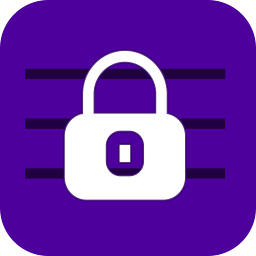

<p align="center">
  
</p>

<h1 align="center" style="padding: 0;">NoteSR</h1>
<h3 align="center" style="padding: 0;">The best security for your notes</h3>

<p align="center">
    <a href="https://github.com/zHd4/NoteSR/releases"></a>
    <a href="https://github.com/zHd4/NoteSR/actions/workflows/java_ci.yml"></a>
    <a href="https://qlty.sh/gh/zHd4/projects/NoteSR"></a>
</p>

**NoteSR** is a secure and offline-first note-taking Android app that creates an encrypted storage space on your device. You can write text notes, attach any type of file to them, and open files directly inside the app — all fully encrypted using AES-256.

---

## 📦 Download

**Latest version:** [v5.2.2](https://github.com/zHd4/NoteSR/releases/tag/5.2.2)  
You can download the APK from the [Releases page](https://github.com/zHd4/NoteSR/releases).

---

## ✨ Features

- 🔐 **AES-256 encryption** — all data is encrypted and stored locally
- 📝 **Text notes** with optional file attachments
- 📂 **Built-in file viewer** — open attached files directly in the app
- 🚫 **No cloud**, no account — 100% offline & private
- 📁 Works with basic files types — images, videos, text files
- 🔄 **Encrypted export & import** — backup and restore your storage
- 🖥️ **Cross-platform CLI tool** for working with encrypted backups: [NoteSR-Cli](https://github.com/zHd4/NoteSR-Cli)
- 🧭 Simple and minimal interface

---

## 🔐 Privacy & Security

NoteSR is built with privacy in mind:

- All content is encrypted using **AES‑256**
- Backups are also encrypted and can only be opened with your key
- No data ever leaves your device without your intent

> ✅ Ideal for journaling, personal records, secure attachments, and more

---

## 🚀 Getting Started

### Install from APK

1. Download the latest `.apk` from the [Releases page](https://github.com/zHd4/NoteSR/releases)
2. Enable installation from unknown sources on your device
3. Install and start using NoteSR

### Build from source

```bash
git clone https://github.com/zHd4/NoteSR.git
cd NoteSR
./gradlew assembleRelease