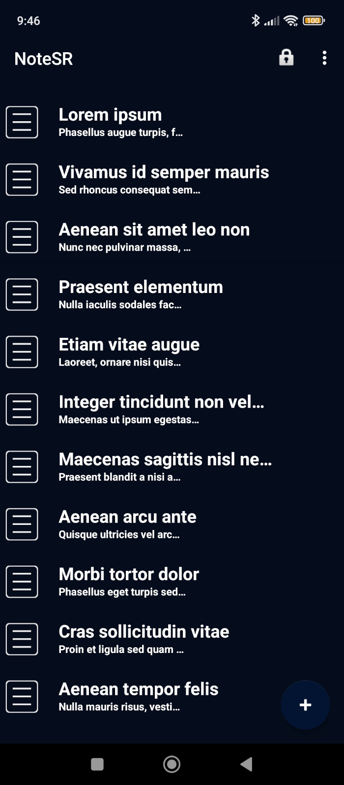
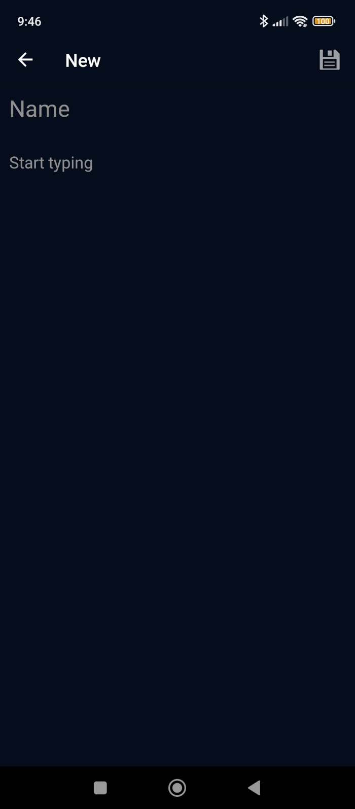

  

<h1 align="center" style="margin: 0; padding: 0;">NoteSR</h1>
<h3 align="center" style="margin: 0; padding: 0;">The best security for your notes</h3>

    
    

NoteSR is an application for storing information securely.
It is a note-taking application with all data encrypted using AES-256 symmetric encryption algorithm.

<h2>Download</h2>

Last version: [4.9](https://github.com/zHd4/NoteSR/releases/tag/4.9)  
[Download APK](https://github.com/zHd4/NoteSR/releases/download/4.9/NoteSR_v4.9.apk)

    
    

